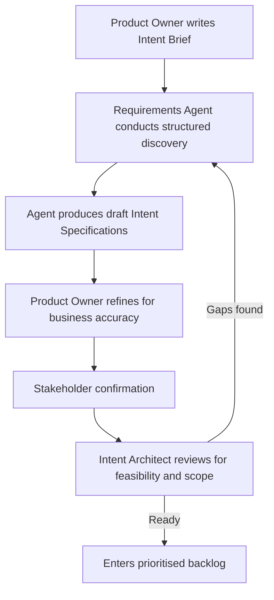

# The Agentic Delivery Model

**Version 1.0, April 2026**

An open methodology for software delivery in the age of autonomous AI agents.

The model will evolve as tooling matures and organisations contribute experience. If you see gaps, contradictions or opportunities, the author welcomes the conversation.

---

## 1. Introduction

The Agentic Delivery Model (ADM) is an open methodology for software delivery in the age of autonomous AI agents. It is freely available, designed to be adapted and intended to evolve as the technology matures.

Agile transformed software delivery. It replaced heavyweight, document-driven processes with collaboration, iteration and responsiveness to change. Over two decades, Agile and its variants became the dominant operating model for technology teams worldwide. That success was well earned.

But Agile was designed for a world where people do the work. Its ceremonies, roles and artefacts all assume that people write the code, people test it and people coordinate the effort. Autonomous AI agents have changed that assumption. The operating model needs to evolve. Not because Agile failed, but because the world it was designed for has moved on.

The ADM preserves what Agile got right: iteration, collaboration and working software as the measure of progress. It restructures what no longer fits: ceremonies built around human coordination, roles defined by manual execution and estimation practices tied to human throughput.

One important distinction. Most organisations today experience AI agents as developer tools. An engineer spins up an agent to help write code, generate tests or refactor a module. Useful, but small-scale. The developer remains the unit of delivery. The team structure, governance and coordination model stay the same.

The ADM is different. It defines an operating model where a fleet of autonomous agents works collectively against a governed backlog, coordinated by architecture and governance rather than by individual developers. Agents are the delivery workforce. People define intent, maintain coherence, verify output and govern the process. The organisational structure, roles, cadence and governance all change to reflect this.

The model is sector-agnostic. It works for greenfield and brownfield environments. It scales from small teams to large technology functions.

What follows is the complete methodology.

---

## 2. The Case for Change

Every mainstream framework for enterprise software delivery was designed around a single assumption: that people execute the work and other people coordinate that execution. Agile, Scrum, SAFe, Kanban and their variants all encode human constraints into their structure. Two-week sprints reflect the limits of collective human working memory. Daily standups compensate for the fact that people forget, miscommunicate and lose alignment. Retrospectives exist because people learn through structured reflection.

AI agents have none of these constraints. They work continuously. They do not context-switch in the way people do. They do not require ceremonies to maintain alignment if they are reading from a shared, well-structured backlog.

But they introduce entirely different constraints. They hallucinate. They struggle with ambiguity. They accumulate technical debt at unprecedented rates. They cannot validate output against business intent without human guidance. They produce code that appears functional but may be structurally incoherent or misaligned with business rules and existing system behaviour.

The result is a mismatch. Organisations are bolting autonomous agents onto operating models designed for manual execution. The agents deliver at machine speed, but the governance, review and coordination structures either throttle that speed back to the pace of the people around them or let agent output flow unchecked into production.

Neither outcome is acceptable. This document defines an operating model native to a world where agents execute the majority of implementation work and people focus on intent, governance and validation.

---

## 3. Principles

The Agentic Delivery Model is built on eight principles.

1. **Intent over instruction.** The highest-value human activity is defining what needs to exist and why, with enough precision that an autonomous agent can execute against it. People specify intent. Agents determine implementation.

2. **Continuous execution, governed checkpoints.** Agents work in continuous flow. People intervene at defined governance intervals, not on every action. The cadence of review is decoupled from the cadence of execution, but must be proportionate to the volume and risk of agent output.

3. **Verification and validation serve different purposes.** Verification confirms that agent output matches the specification. Validation confirms that the specification serves the business intent. Agents and automated tests handle verification. People own validation. Both are required. Neither replaces the other.

4. **Architectural coherence is a first-class concern.** Agents optimise locally. People must maintain system-level coherence. Without deliberate architectural stewardship, agent-generated codebases will fragment rapidly.

5. **Technical debt is measured, not assumed.** Agents can produce enormous volumes of code. Volume is not value. Every governance checkpoint must include an explicit assessment of whether agent output is creating or reducing structural debt.

6. **Precision of intent determines quality of output.** The quality of what an agent delivers is directly proportional to the precision of the specification it works against. Definition of Ready is the most critical quality gate in the entire process. Precision is iterative, not absolute. Specifications improve through feedback loops, not upfront perfection.

7. **Human accountability is non-negotiable.** Agents execute. People are accountable for what agents produce. Every agent-generated artefact has a named person who approved it into production. Accountability frameworks, senior management regimes and organisational governance all require a person in the chain of responsibility. This is a regulatory and operational requirement, not a suggestion.

8. **Transparency of provenance.** All agent-generated work must be traceable: which agent, which model, which specification, which version of the codebase. Audit trails are not optional in regulated environments.

---

## 4. The Design & Delivery Cycle

In traditional Agile, the space between what the business needs and what gets built is filled by people talking to each other. A product owner defines priorities. A business analyst runs workshops, interviews stakeholders and translates business need into user stories. Developers ask questions in refinement sessions. It works because people share context, make reasonable inferences and catch misunderstandings in conversation.

Agents cannot do this. They take specifications literally. They fill gaps with assumptions that may be plausible but wrong. They do not know what they do not know.

The requirements process must therefore become more rigorous. But agents also make this possible: they can conduct structured requirements interviews with stakeholders, generating detailed Intent Specifications that other agents then implement.

### 4.1 The Delivery Cycle

The ADM delivery cycle has two distinct phases.

**Design phase (iterative).** A product owner writes an Intent Brief: a short statement of what they want to achieve and why, with enough context to scope a discovery session. A requirements agent takes the Brief and conducts structured discovery with stakeholders, producing one or more draft Intent Specifications. The product owner refines them for business accuracy. An Intent Architect reviews for feasibility and scope, adds constraints and tightens acceptance criteria. The specification iterates between these roles until it passes the Definition of Ready ([Appendix B.4](#b4-definition-of-ready-for-agents)). This phase is deliberately iterative. Precision is built through cycles of drafting, review and refinement.

**Build phase (sequential, with feedback).** Once a specification passes the Definition of Ready, it enters the Execution Tier. An implementation agent picks it up, creates a feature branch, implements the change, runs automated tests and creates a pull request (PR). The Review Agent, Testing Agent and Security Agent perform automated checks. The PR reaches the Governance Tier for human verification. If approved, it is merged and flows through continuous integration and continuous deployment (CI/CD) towards release. If the agent encounters ambiguity during implementation, the clarification mechanism (Section 4.3) applies: technical questions are resolved agent-to-agent, intent questions return to a person. A rejected PR at the Governance Tier returns to the agent for rework. The build phase is not a single pass. It is a controlled sequence with defined feedback loops.

The design phase is where the thinking happens. The build phase is where the agent fleet executes. If the design phase did its job, the build phase should be fast and predictable, with minimal clarification cycles. Rework in the build phase almost always traces back to insufficient precision in the design phase.

**Specification sources.** Intent Specifications can originate from several sources: human discovery (the primary path described above), agent-led problem detection (AIOps agents, observability platforms, automated monitoring), or ITIL incident and problem management processes (see [Appendix D](#appendix-d-itil-and-operational-frameworks)). Defects detected by operational agents or surfaced through incident investigation enter the same delivery cycle. The finding becomes an Intent Brief, discovery produces an Intent Specification, agents implement the fix and people verify. The Product Owner prioritises all sources through the same process. The delivery cycle is identical regardless of origin.

### 4.2 Intent Briefs and Requirements Discovery

#### 4.2.1 Problem Discovery

Most work items proceed directly to an Intent Brief (described in 4.2.2 below). This section covers the exception: what to do when the problem itself is not yet well enough understood to write one.

Not every request arrives with a clear business problem. A stakeholder who says "I need a report showing claims by region" may actually need "I need to understand why claims costs are rising in the North West." Before writing an Intent Brief, the Product Owner may need to establish what the problem actually is.

Problem discovery is a distinct cycle that sits before the Intent Brief. The Product Owner works with a requirements agent to explore the problem space with stakeholders: what is happening, what should be happening, what is the impact, what has been tried. The output is not a specification. It is a problem statement with enough clarity for the Product Owner to decide whether to commission an Intent Brief.

Problem discovery may conclude that no technology change is needed, or that the real problem is different from the one initially described. This is valuable. It prevents Intent Briefs being written for the wrong problem. When the problem is confirmed, the Product Owner writes an Intent Brief and the standard discovery cycle begins.

Not every piece of work needs problem discovery. Well-understood changes ("add a field", "change a validation rule", "fix this defect") can proceed directly to an Intent Brief. Problem discovery applies when the underlying need is unclear, when the stakeholder is describing a symptom rather than a cause or when the scope of the problem is not yet understood.

#### 4.2.2 The Intent Brief

Discovery starts with a person decision about what to build. The Product Owner writes an Intent Brief: a short, structured statement of the business objective, the context behind it and the stakeholders who own the domain knowledge. The Brief is not a specification. It is the input that gives the requirements agent something to work from.

An Intent Brief contains: a business objective, success criteria, known constraints, stakeholders to consult, an indication of complexity and a recommendation on discovery mode (see below). It sits in the backlog alongside Intent Specifications, but at an earlier state. The template is in [Appendix B.1](#b1-the-intent-brief).

A single Intent Brief may produce one Intent Specification or several. A large objective ("build a customer self-service portal") will decompose into multiple specifications during discovery. The Brief is the parent. The specifications are the output.

#### 4.2.3 Agent-led Discovery

Requirements agents interview stakeholders using structured question frameworks. The agent takes over the discovery and drafting work traditionally owned by business analysts. The product owner takes over refinement and sign-off. The implications for existing BA roles are covered in Section 6.8 and the transition guidance in [ADOPTION.md](ADOPTION.md).

The model prescribes the process, not the medium. A requirements agent may interact with stakeholders through text, voice, video or guided forms. The medium will evolve. What matters is the structure: a requirements agent conducts discovery against an Intent Brief, supervised by a product owner, and produces one or more draft Intent Specifications.

The process follows a repeatable pattern:



1. A product owner writes an Intent Brief and assigns it to a requirements agent.
2. The requirements agent conducts structured discovery with the stakeholders named in the Brief. The agent asks progressively detailed questions about user personas, business rules, edge cases, integration points, regulatory constraints and acceptance criteria.
3. The agent produces one or more draft Intent Specifications (see [Appendix B.2](#b2-the-intent-specification)).
4. The product owner refines each draft for business accuracy, completeness of acceptance criteria, edge case coverage and consistency with existing business rules. They add domain context the agent could not extract from discovery. They correct where the agent has captured the letter of what was said but missed the intent.
5. The refined specification is presented back to the business stakeholder for confirmation.
6. The finalised Intent Specification is peer-reviewed by an Intent Architect for feasibility and scope before entering the backlog. If the Intent Architect identifies gaps, the specification returns to the requirements agent for further discovery.

Complex features require multiple sessions across different stakeholders. The requirements agent maintains context across sessions and flags contradictions between them.

#### 4.2.4 Paired Discovery

Not all discovery can run unsupervised. When the domain is ambiguous, the stakeholder contradicts themselves or the subject matter is too complex for the agent to navigate alone, a person needs to be in the loop during the session itself. This is paired discovery: the Product Owner or Intent Architect works alongside the requirements agent in real time, steering the conversation, correcting course and adding context the agent does not have.

This is the same instinct as a BA and a PO sitting in a workshop together because the subject matter is too messy for one person to run alone. The agent is the BA. The person pairs when the complexity warrants it.

The Intent Brief flags this. A Brief marked as high complexity or covering an unfamiliar domain should default to paired discovery. A Brief covering a well-understood change ("add a field", "change a validation rule") can run as standard agent-led discovery. The routing decision belongs to the Product Owner at the point they write the Brief.

Paired discovery is not a failure mode. It is a legitimate operating pattern. Some work is simple enough for autonomous discovery. Some needs a person in the room.

**Problem discovery, not just requirements capture.** The requirements agent can go beyond structured questioning. A stakeholder who says "I need a report showing claims by region" may actually need "I need to understand why claims costs are rising in the North West." The agent probes for the underlying need, challenges assumptions and surfaces the real business problem. The product owner decides whether that problem is the right one to solve.

**Speed matters.** A product owner and a requirements agent should move from an Intent Brief to a Ready Intent Specification in hours, not days. Brief, discovery, draft, refinement, feasibility check, backlog. This cycle repeats throughout the working day. If the specification pipeline slows, agents have nothing to work on. The requirements process is the engine that drives throughput.

### 4.3 Iterating Specifications

Intent Specifications are living documents. They evolve through three feedback loops:

**Pre-implementation iteration.** Before an implementing agent begins work, an Intent Architect reviews the specification for feasibility, scope appropriateness and testability. They may trigger a further requirements interview to resolve gaps.

**Implementation feedback.** When an implementing agent encounters ambiguity during execution, the resolution path depends on the type of ambiguity. Technical clarifications (API contracts, data formats, implementation patterns) can be resolved agent-to-agent: the implementing agent consults the relevant agent (requirements, testing or review) and they resolve it directly. Intent clarifications (what the business actually wants, which behaviour is correct, scope decisions) must always return to a person. If in doubt, escalate to a person. Getting intent wrong is more expensive than asking. When a clarification does require human input, it triggers a focused follow-up with the relevant stakeholder, mediated by the requirements agent. The specification is updated and the implementing agent resumes.

**Post-implementation refinement.** After delivery, the verification process may reveal that the specification itself was incomplete or imprecise, even if the agent followed it correctly. These findings feed back into a specification quality review, improving future intent design.

### 4.4 The Investment in Requirements

The ADM requires more care in requirements, but not more time. The agent-led discovery process is faster than traditional workshops and BA cycles. What changes is precision. A vague specification produces vague output at machine speed, compounding the problem. Precision upfront costs less than rework downstream.

In practice, product owners spend most of their time in a rapid cycle: discovery with stakeholders, refine the agent-generated draft, hand off for feasibility review, move to the next objective. The time previously spent in standups, sprint planning and backlog grooming goes into this cycle instead. The product owner works from an agent-generated draft rather than a blank page. The pace is fast because it has to be: the agent fleet is waiting for work.

### 4.5 Where the ADM Applies

The ADM applies to any work where a person can specify the intent and an agent can execute the implementation. The following are examples, not an exhaustive list.

**Backend and API development.** Business logic, service layers, API endpoints, database operations and background processing. These map well to agent execution because the intent can be precisely specified through acceptance criteria, API contracts and data schemas.

**Frontend development.** UX research and interaction design remain specialist disciplines. The ADM enters the workflow at the implementation stage: agents work from component libraries, design systems and approved designs to generate frontend code. The Design Steward (Section 6.4) owns the design system and codifies the constraints that agents work within. The Intent Specification for UI work includes Design Constraints referencing specific components, interaction patterns and responsive breakpoints. The Design Agent checks agent output against these constraints. Verification includes visual regression testing alongside functional checks.

**Integration development.** Integration work is a natural fit. Integration specifications are inherently precise: API contracts, data mappings, error handling rules and message formats. Intent Specifications for integration work map closely to the technical contracts they implement. Agents working on integrations benefit from clear boundaries and well-defined success criteria.

**Data and analytics.** Data pipeline development, ETL processes and analytics implementations follow the same pattern. Intent Specifications for data work define source systems, transformation logic, quality checks and output schemas. Agents can generate pipeline code, SQL transformations and data quality tests. The Verification Engineer validates that the output data meets business requirements, not just that the code runs.

**Infrastructure and platform engineering.**

Infrastructure-as-code is agent-compatible. Intent Specifications for infrastructure work define the desired state: environments, networking, security groups, scaling policies. Platform Agents generate Terraform, CloudFormation or equivalent configurations. Human oversight is tighter here because infrastructure changes have wider blast radius. All Platform Agent output requires explicit human approval before application.

The ADM covers the cycle from specification to deployment. Activities that precede specification, such as UX research, user testing and product discovery, sit outside this model. These disciplines may have their own agent-assisted workflows, but that is a separate concern. Their output feeds into the ADM as context for Intent Briefs and Intent Specifications. Section 18 defines the broader boundaries.

---

## 5. Architecture and Standards Governance

Agents are powerful local optimisers. Given a well-specified task, they will produce working code that satisfies the acceptance criteria. But they have no inherent sense of system-level coherence. Without explicit architectural constraints, a codebase built by multiple agents working on separate stories will drift rapidly towards inconsistency.

Architecture and standards must be defined, codified and enforced at two levels.

### 5.1 Company-Level Standards

These apply across all products and projects within the organisation. They include:

- Technology stack decisions (languages, frameworks, cloud services)
- Security standards and compliance requirements
- Coding conventions (naming, structure, patterns)
- API design standards
- Data governance and residency rules
- Testing standards (coverage expectations, test categories)
- Design system standards (component libraries, interaction patterns, accessibility requirements, brand rules)
- Documentation standards
- Dependency management policies
- Business rules and domain standards (regulatory calculations, pricing logic, eligibility criteria, service level commitments)

Company-level standards are codified in a machine-readable format that agents consume directly. The specific mechanism varies by tooling (see [Appendix C.4](#c4-tooling-configuration)), but the key point is that these standards are not PDF documents that people read and agents ignore. They are embedded into the agent's operating context.

### 5.2 Project-Level Standards

These extend company standards with project-specific architectural decisions:

- Domain model and bounded contexts
- Service boundaries and integration patterns
- Database schema conventions
- State management approach
- Error handling patterns
- Performance requirements and constraints
- Feature flag strategy

Project-level standards are maintained by the System Steward (see Section 6.3) and reviewed at the weekly Strategic Tier session. They are codified in project-level agent configuration files that sit alongside the codebase.

### 5.3 Design System Standards

When a product has a user-facing surface, design constraints are codified and enforced through the same mechanisms as architectural standards: agent configuration files, specification constraints and human verification. The Design Steward role (Section 6.4) owns this coherence. Design system standards include component libraries, interaction patterns, layout conventions, accessibility requirements and brand rules. These sit alongside architectural and coding standards as first-class guardrails for agent behaviour.

### 5.4 Standards as Agent Guardrails

Standards are not advisory. They are guardrails that constrain agent behaviour. When an agent generates code that violates an architectural or design standard, the automated verification pipeline should catch it before it reaches human review. This means standards must be expressed as enforceable rules, not aspirational guidelines.

Examples of enforceable standards: "All API endpoints must return standardised error responses using the ErrorResponse schema." "Database access must use the repository pattern. No direct SQL in service classes." "All new components must include unit tests with a minimum of three test cases covering happy path, validation failure and error handling." "All user-facing components must use the approved component library and meet WCAG 2.1 AA accessibility requirements."

---

## 6. Roles

The ADM redefines human roles and introduces the agent as a formal team member. The work shifts from writing code to shaping intent, verifying outcomes and governing coherence.

### 6.1 Intent Architect

The Intent Architect combines work that has traditionally sat across senior engineering, business analysis and solution or technical architecture. The Intent Architect translates business need into an executable Intent Specification that is feasible in scope, consistent with system constraints and precise enough for an autonomous agent to deliver without guesswork.

This role owns feasibility and scope at the delivery boundary. That includes defining acceptance criteria, integration points, non-functional expectations, boundaries, sequencing assumptions and the parts of the problem that should be decomposed before agent execution begins. Where a traditional team might split this work across a business analyst, a senior developer and a solution architect, the ADM brings it together so that the execution handoff is coherent.

This is one of the hardest roles in the model. It requires domain understanding, system-level awareness and the ability to anticipate where an agent will struggle or go wrong. Senior engineers, lead developers, solution architects, technical architects and technically strong business analysts are the natural fit.

The Intent Architect also reviews agent-generated specifications from requirements interviews, ensuring they are feasible, appropriately scoped and consistent with the System Steward's guidance before they enter the backlog. The System Steward and Verification Engineer may also review Intent Specifications before they enter the backlog, particularly for high-complexity or cross-cutting specifications. This is advisory, not a gate. The Intent Architect retains authority to mark a specification as Ready.

Agents assist Intent Architects directly. A Review Agent can pre-check specifications for completeness, flagging missing acceptance criteria, undefined integration points, unclear boundaries or ambiguous scope before the person reviews them. This does not replace the Intent Architect's judgement. It removes mechanical errors so the person can focus on the harder questions: is this the right thing to build, is it scoped correctly and will it fit the system?

### 6.2 Verification Engineer

The Verification Engineer reviews agent output against the Intent Specification and structural consistency. Unlike traditional code review, they assess whether the changeset meets the acceptance criteria, includes meaningful tests and avoids hidden debt or inconsistency that automated checks have missed. The Verification Engineer verifies that what was built matches what was specified. Validation of whether the specification itself serves the business intent is the Product Owner's responsibility (see Principle 3).

The Verification Engineer is also the primary assessor of code quality at the governance checkpoint. The Review Agent flags obvious quality issues (duplication, complexity, naming violations) automatically. The Verification Engineer assesses the harder questions: is this code maintainable, is it proportionate to the problem, does it follow the spirit of the standards as well as the letter. Over time, code quality assessment should include whether the codebase is growing proportionately to value delivered, or accumulating bloat from agent-generated boilerplate.

They operate as the final quality gate after automated review, testing and security scanning have filtered out basic failures. The role requires experienced engineers who understand systems at a level above individual functions and files. Junior engineers can assist with evidence gathering, but senior judgement is needed for the harder calls.

### 6.3 System Steward

The System Steward is responsible for coherence across the codebase and the surrounding delivery system. As agents work on individual specifications in isolation, the codebase will naturally drift towards local optimisation at the expense of global consistency. The System Steward owns the architectural direction, maintains the system-level configuration that constrains agent behaviour and identifies when refactoring is needed to restore coherence.

The System Steward also owns technical debt management. They maintain the Coherence Register (see [Appendix B.7](#b7-the-coherence-register)), make explicit accept or remediate decisions on identified debt and commission agent-driven refactoring work when debt reaches unacceptable levels. Technical debt has a concrete impact and a named owner. It appears in the backlog as a governed item, prioritised alongside feature work.

In a multi-product organisation, this role may span multiple products, ensuring that patterns, standards and control points remain coherent across the estate.

### 6.4 Design Steward

The Design Steward is responsible for design coherence across any product with a user-facing surface. Agents can generate UI, but without codified design constraints they produce generic, inconsistent interfaces. The Design Steward owns the design system: component library, interaction patterns, layout conventions, accessibility standards and brand rules.

These constraints are codified in the same way as architectural standards. They live in agent configuration files and feed into Intent Specifications as a Design Constraints section alongside the existing Technical Constraints. The Design Agent (see [Appendix C.3](#c3-agent-capability-and-role-definitions)) applies these constraints during implementation. The Design Steward reviews agent-generated UI as part of the verification process, checking for visual consistency, interaction correctness and accessibility compliance.

This role is optional. It applies only when the product has a user-facing surface. In smaller teams, a single person may hold both System Steward and Design Steward responsibilities if they have both skill sets. In larger teams or design-intensive products, this is a dedicated role. The Design Steward maintains a Design Register (analogous to the Coherence Register) that tracks design decisions, component usage patterns and known deviations. An example Design Steward role profile is provided in the [Profiles folder](Profiles/README.md).

### 6.5 Product Owner (evolved)

The Product Owner becomes significantly more important in this model. A vague story used to get clarified through conversation with a developer. A vague specification now either produces a guess or blocks execution. The tolerance for imprecision drops sharply.

The Product Owner absorbs work previously spread across business analysts and project coordinators. They are accountable for the precision, completeness and priority of Intent Specifications: supervising agent-led discovery, refining agent-generated drafts and responding to implementation clarifications. They must specify what an autonomous system needs to deliver correctly, not what a colleague could have inferred.

In larger organisations or products with distinct domains, multiple Product Owners operate in parallel. Each PO owns a product area or domain, running their own specification pipeline and discovery sessions. The model scales naturally: more POs mean more specifications entering the backlog, which an expanded agent fleet can absorb. What matters is that each specification has a single accountable PO, not that there is a single PO across the entire product.

The Product Owner is also a potential point of failure. Every core ADM role is. If the PO is unavailable, the specification pipeline stalls: no specifications are signed off, clarification requests go unanswered and agents block. If an Intent Architect is absent, specifications queue up unreviewed. If the System Steward is unavailable, coherence guidance stops and agents make decisions without constraint. If the sole Verification Engineer is out, the review queue grows and nothing reaches production. In teams where any core role is held by a single person, a nominated colleague should be cross-trained to provide continuity. For the PO specifically, a nominated Intent Architect should be able to cover specification sign-off and clarification responses. This does not mean the Intent Architect becomes the PO. It means the team does not stall when one person is absent.

### 6.6 The Agent (as team member)

AI agents are formal participants in the delivery team, not tools. They have assigned work items, produce traceable output and are subject to performance evaluation. Agent fleet performance should be measured on completion rate, first-pass acceptance rate, technical debt contribution score and clarification request rate.

A high clarification request rate may indicate poor specification quality rather than poor agent performance. This distinction matters.

The detailed agent capability note and indicative agent role definitions are provided in [Appendix C.3](#c3-agent-capability-and-role-definitions).

Example person and agent role profiles are provided in the [Profiles folder](Profiles/README.md).

### 6.7 Productivity, Estimation and Measurement

The ADM produces dramatically more output per person than a traditional delivery model. Human effort moves from writing code to specification quality, verification quality and system governance.

#### 6.7.1 Estimation is Replaced by Readiness and Empirical Forecasting

Traditional Agile uses story points or time estimates to plan sprint capacity. The ADM has no sprints and no fixed time periods. Agents execute continuously against a prioritised backlog. The relevant question becomes: is this specification ready for agent execution?

The Definition of Ready in [Appendix B.4](#b4-definition-of-ready-for-agents) replaces estimation. A specification that meets the readiness standard can be assigned to an agent. Complexity assessment in the Intent Specification template drives routing and decomposition decisions. If a specification is too large for reliable single-agent execution, the Intent Architect decomposes it. If it requires human pairing, the governance session allocates it. Capacity planning meetings and story point estimation disappear.

**The business still needs forecasting.** Removing estimation from the delivery team does not remove the need for the rest of the organisation to know when change will be ready. Business stakeholders need delivery forecasts to arrange user acceptance testing, schedule training, brief customer service teams, plan communications and coordinate with external partners. This is a weakness in Agile too. Story points give internal velocity but do not translate into dates that business stakeholders can act on.

The ADM addresses this through empirical throughput data. Teams measure actual cycle times by complexity band: small specifications take X hours on average, medium Y, large Z. Over time this builds a reliable empirical model. The Product Owner uses this data to communicate expected delivery windows to business stakeholders. A forecast based on observed throughput is more accurate than one based on estimated story points, because it measures what actually happens rather than what people think will happen. The metrics in Section 14.1 formalise this. Practical guidance on forecasting and business readiness is in [ADOPTION.md](ADOPTION.md).

Detailed guidance on what people do day-to-day, where bottlenecks form and the leading indicators that teams should monitor is also provided in [ADOPTION.md](ADOPTION.md).

### 6.8 Roles That Change, Split or Remain

The ADM restructures the delivery function. Traditional roles may disappear from day-to-day software delivery, split across people and agent responsibilities or remain with a tighter governance focus. The full indicative role transition table is in [ADOPTION.md](ADOPTION.md). Practical guidance on role transition is also in [ADOPTION.md](ADOPTION.md).

### 6.9 Onboarding and Career Paths

The ADM creates new entry points and progression routes. Guidance on career paths, cross-training and how people enter and progress through ADM roles is in [ADOPTION.md](ADOPTION.md).

---

## 7. Team Structure

The ADM defines roles and accountabilities, not a fixed organisation chart. Every organisation will staff differently depending on product complexity, regulation, legacy burden and how much broader business change sits around software delivery.

The minimum ADM operating shape requires named human accountability for intent (Intent Architect), verification (Verification Engineer), coherence (System Steward), business outcome (Product Owner) and platform governance (Platform Engineer), plus a governed agent fleet. In smaller teams, one person may cover more than one of these. What matters is that the responsibilities are explicit.

Illustrative team structures, scaling guidance, platform engineering detail and caveats on before-and-after comparisons are in [ADOPTION.md](ADOPTION.md). The full illustrative organisation comparison is also in [ADOPTION.md](ADOPTION.md).

---

## 8. Key Artefacts

The ADM depends on a small set of artefacts that make agent execution governable. The most important are the Intent Specification, the Definition of Ready, the Definition of Done, the Coherence Register and the testing strategy.

Detailed templates and worked examples are provided in [Appendix B](#appendix-b-key-artefacts). Section 8 provides the summary; the appendix provides the full artefact definitions including the Intent Brief ([B.1](#b1-the-intent-brief)), the Intent Specification template ([B.2](#b2-the-intent-specification)), the mapping from traditional Agile artefacts ([B.3](#b3-intent-specifications-vs-epics-and-pbis)), the Definition of Ready ([B.4](#b4-definition-of-ready-for-agents)), the Definition of Done ([B.5](#b5-definition-of-done-extended)), the Testing Strategy ([B.6](#b6-testing-strategy)) and the Coherence Register ([B.7](#b7-the-coherence-register)).

---

## 9. Tooling and Agent Governance

The ADM is tool-agnostic, but it is not control-agnostic. Agents require explicit boundaries on access, identity, sandboxing, model usage, knowledge sources, resilience measures and security controls.

**Tooling maturity note.** The tooling landscape for agentic software delivery is evolving rapidly. The guidance in this section and in [Appendix C](#appendix-c-tooling-and-agent-governance-considerations) reflects the current state of available tools at the time of writing. It should be treated as alpha guidance that will be updated as tooling matures to support ADM patterns natively. Organisations should expect that specific configuration mechanisms, access control models and integration patterns will change. The principles (governed access, scoped identity, provenance, sandboxing) are durable. The implementation details are not.

Detailed guidance on agent capability, role definitions, access controls, sandboxes, model selection, knowledge management ([C.7](#c7-knowledge-management)), resilience and agent security threats is provided in [Appendix C](#appendix-c-tooling-and-agent-governance-considerations). Separate companion notes on enterprise tooling scenarios are provided in the [Tooling folder](Tooling/README.md).

---

## 10. Delivery and Governance Cadence

### 10.1 The Governance Tier: Daily Review

The daily governance session replaces both the traditional standup and the sprint review. It is a working session, not a status update.

**Duration:** 60 minutes

**Attendees:** Product Owner (facilitates), Verification Engineers, Intent Architects, System Steward. Platform Engineer attends when fleet health or infrastructure issues are flagged. The Delivery Lead may attend but this is a delivery governance session, not a management meeting.

**Preparation.** Attendees should review their areas before the session begins. Verification Engineers should have reviewed the overnight PR queue and formed an initial view on each changeset. Intent Architects should have reviewed the clarification queue for items in their domain. The Product Owner should have reviewed what was delivered overnight against current priorities. The System Steward should have checked for cross-cutting concerns or coherence issues in the queue. Without this preparation, the session becomes a reading exercise and will overrun. Teams should allow 15 to 30 minutes of individual preparation time before the session.

**Agenda:**

1. **Overnight output review (30 mins).** Walk through all agent-generated PRs from the previous cycle. For each: does it pass verification? Does it serve the intent? Approve, reject with feedback or flag for System Steward review.
2. **Clarification queue (15 mins).** Review all items where agents have requested clarification from a person. Provide answers, update specifications, return items to the backlog.
3. **Backlog prioritisation (10 mins).** Reorder the Ready backlog based on what has been learned. Move new items to Ready if they pass the Definition of Ready.
4. **Fleet health check (5 mins).** Are agents blocked? Are there infrastructure issues? Is agent utilisation acceptable?

**Output:** Updated backlog. Approved PRs merged. Clarifications resolved. Blocked items escalated.

### 10.2 The Strategic Tier: Weekly Review

The weekly strategic session addresses what daily governance cannot: system-level coherence, architectural direction and business outcome alignment.

**Duration:** 90 minutes

**Attendees:** Product Owner (facilitates), System Steward, Security Lead. Intent Architects and Verification Engineers attend as needed. The Delivery Lead attends where people, capacity or organisational escalation is relevant. In regulated environments, the accountable executive or their delegate should attend periodically.

**Agenda:**

1. **Metrics review (15 mins).** Review all ADM metrics (see Section 14). Identify trends. Flag anomalies.
2. **Architecture coherence (30 mins).** System Steward presents the Coherence Register. Review new architectural decisions. Assess technical debt. Commission refactoring where needed.
3. **Specification quality review (15 mins).** Are specifications improving? What patterns of clarification requests are recurring? Where do Intent Architects need to invest more detail?
4. **Business alignment (15 mins).** Product Owner confirms that delivery direction aligns with business outcomes. Raise any strategic pivots that affect the backlog.
5. **Agent and tooling review (15 mins).** Model performance, cost trends, access control changes, tooling updates.

**Output:** Updated Coherence Register. Architecture decisions documented. Specification quality actions assigned. Metrics published.

In regulated environments, the Strategic Tier should feed a recurring assurance and oversight update for the accountable executive, risk forum or equivalent governance body. In many organisations this remains monthly. In faster-moving environments or where change is materially customer-affecting, a fortnightly cadence may be more appropriate. This is a formal oversight overlay fed by the Strategic Tier, not an additional delivery tier.

### 10.3 The Execution Tier

Agents work continuously against a prioritised, intent-defined backlog. Each work item that enters the Execution Tier must have passed the Definition of Ready (see [Appendix B.4](#b4-definition-of-ready-for-agents)). Agents pick up the highest-priority ready item, create an isolated feature branch, implement the change, run automated tests and create a pull request linked to the originating work item.

When an agent encounters ambiguity it cannot resolve from the specification, it must stop and flag the item for clarification from a person rather than guessing. The cost of guessing wrong compounds rapidly as downstream work builds on the wrong assumption.

Agents work in isolated branches within the source control system. They never commit directly to protected branches. Every piece of agent work is reviewable as a discrete, bounded changeset.

#### 10.3.1 Agent Concurrency and Coordination

The Scheduling Agent (SCH-1) is responsible for orchestrating how work flows through the agent fleet. When an Intent Specification reaches Ready status, the Scheduling Agent assesses what skills are needed to deliver it: implementation, security analysis, performance testing, accessibility checking, documentation. It then determines whether a single agent with the required skills can deliver the work, or whether multiple agents with different specialisms need to coordinate.

For a well-bounded specification that needs only implementation and standard testing, a single agent working in an isolated feature branch is sufficient. For specifications that span multiple concerns (a new API endpoint that also requires security hardening, performance validation and documentation updates), the Scheduling Agent orchestrates multiple agents working against the same feature branch. It sequences their contributions to avoid conflicts and maintains context across the work. The output remains a single PR for governance review.

Multiple agents work concurrently across the fleet, each on separate feature branches. Agents do not commit to protected branches. This isolation prevents direct file-level conflicts during execution. How many agents work in parallel depends on backlog depth, review capacity and cost appetite.

The deeper coordination challenge is overlapping scope: two specifications that touch the same service, file or API contract. The Scheduling Agent manages this proactively. Before assigning a Ready specification, it checks the specification boundaries (the "Must not touch" and "Integration points" fields) against all specifications currently in progress. When it detects overlap, it recommends one of three approaches:

**Combine.** If two specifications affect the same area and are related, the Scheduling Agent flags them for the Intent Architect to merge into a single Intent Specification. One agent delivers both changes in one branch. One PR, one review, no conflict.

**Sequence to the same agent.** If two specifications are distinct but overlap on the same code, the Scheduling Agent assigns them sequentially to the same agent working in the same branch. The agent has full context of the first change when it starts the second. The output is either one combined PR or two sequential PRs, but the agent manages its own consistency.

**Sequence to different agents.** If the overlap is minor, the Scheduling Agent holds the second specification until the first PR is merged. The second agent then works against the updated codebase. Simple sequencing, no special handling needed.

When the Scheduling Agent detects overlap that requires a judgement call (which specification should take priority, whether boundaries should be redrawn), it flags the conflict for the Intent Architect or System Steward. The person decides. The Scheduling Agent executes the decision.

**Residual conflicts.** When conflicts do occur despite proactive scheduling (edge cases, unanticipated overlap), the implementing agent resolves them as a technical clarification (rebasing against the updated main branch) without requiring human intervention. Only if the conflict involves an intent-level question (which specification's approach should take precedence) does it escalate to the Governance Tier.

---
## 11. Delivery, Release and Working Patterns

The ADM enables daily releases. If the Governance Tier approves PRs each morning, approved changes flow through the CI/CD pipeline and reach production the same day. The constraint is whether the organisation trusts its verification process and whether the pipeline supports daily release frequency, not agent speed.

Release strategy is a Strategic Tier decision. The ADM supports any cadence from continuous to batched. The choice depends on the organisation's risk appetite, regulatory context and pipeline maturity.

Development environments are ephemeral. Each agent works in an isolated sandbox with an isolated branch, build and test environment. Agents do not step on each other's work. Staging and production environments follow conventional promotion patterns.

**Coordinated releases and feature flags.** An Intent Specification is the smallest unit of agent execution. It is not necessarily the smallest unit of user-visible release. When multiple Intent Specifications contribute to a larger feature, individual specifications may deploy to production behind a feature flag before the full feature is ready for users. This decouples deployment from release. Code reaches production early, reducing integration risk, but users see the feature only when the Product Owner activates the flag once all contributing specifications are complete. The Strategic Intent (see [Appendix B.3](#b3-intent-specifications-vs-epics-and-pbis)) provides the grouping mechanism. The Product Owner tracks which specifications within a Strategic Intent are complete and decides when to activate the flag. Feature flag management should be reviewed at the Strategic Tier: which flags are active, which should be retired and which are accumulating debt by remaining in the codebase too long.

The ADM also supports follow-the-sun and flexible working patterns. Agents work continuously regardless of time zone. Human governance sessions are scheduled to match the team's working hours. Where teams span multiple time zones, governance sessions are staggered so that human review remains timely without requiring antisocial hours.

Detailed guidance on release progression, environment strategy, feature flags, follow-the-sun patterns, compressed working and the core tension of keeping agents fed is in [ADOPTION.md](ADOPTION.md).

---
## 12. ITIL and Operational Frameworks

The ADM changes how software changes are generated and governed, but the surrounding service obligations remain. Operational disciplines such as change management, incident management, problem management, service level management and configuration management continue to apply. The ADM's provenance model (every change traced from specification to deployment) strengthens change management. Agent-generated changes carry richer metadata than manual ones. Incident and problem management processes feed findings back into the delivery cycle as Intent Briefs, closing the loop between operations and development.

Detailed discussion of how the ADM aligns with ITIL is in [Appendix D](#appendix-d-itil-and-operational-frameworks). Practical guidance on day-to-day operations is in [ADOPTION.md](ADOPTION.md).

---

## 13. Governance for Regulated Environments

The ADM's governance model applies to all environments. In regulated environments, additional controls, accountability frameworks and assurance obligations apply. This section defines the universal governance principles first, then the sector-specific overlays.

### 13.1 Provenance and Audit Trail

Every agent-generated artefact carries metadata: which agent produced it, which model version was used, which Intent Specification it was working against, which version of the codebase it started from and who approved it for integration. This creates a complete audit trail from business requirement to deployed code. This applies in all environments, not just regulated ones.

### 13.2 Separation of Execution and Approval

Agents never approve their own work. The Governance Tier ensures that every piece of agent output receives independent verification from a person before it enters the codebase. This maker-checker separation is a universal governance principle. In regulated environments, it supports the segregation of duties requirements common across financial services, healthcare, government and legal sectors. Organisations should verify that their specific regulatory framework accepts this separation model.

**Segregation extends to people.** A person who authored or refined an Intent Specification must not be the person who verifies the resulting PR. The specification author has assumptions baked in that make them a poor judge of whether the output matches the intent objectively. When covering for absence, the stand-in must not verify work they specified. In regulated environments this is a firm requirement. In smaller teams where maintaining segregation is difficult, delivery should pause on affected items until someone without a conflict is available. This is a feature of the control framework, not a flaw. Compromising segregation to maintain throughput defeats the purpose of governed delivery.

**Absence and continuity.** In smaller ADM teams, a single person may be the only Verification Engineer, the only System Steward or the only Product Owner. Illness, leave or departure creates a control gap: verification cannot happen, coherence guidance stops or the specification pipeline stalls. Regulated environments must plan for this explicitly. Each core ADM role should have a named backup who is cross-trained to provide continuity (see [ADOPTION.md](ADOPTION.md) Section 5 on cross-training). The backup must be someone who can maintain segregation of duties for the work in question. If no suitable backup is available, delivery on affected items should pause until the role holder returns or a replacement is in place. The Delivery Lead is responsible for maintaining a continuity plan that maps each core role to its backup. This plan should be reviewed at the Strategic Tier and updated when team composition changes.

### 13.3 Accountability Frameworks

Every regulated sector has a form of named human accountability for technology decisions. In financial services, this is the Senior Manager Function (SMF24 under PRA/FCA oversight). In healthcare, the accountable officer under CQC. In government, the Senior Responsible Owner. In legal services, the Compliance Officer for Legal Practice (COLP) under SRA regulation. The principle is universal: a named person must be accountable for the governance of AI-generated change.

The ADM provides this through its three-tier structure: automated verification at the Execution Tier, human validation at the Governance Tier and strategic oversight at the Strategic Tier. The accountable executive does not need to review every PR. They need confidence that the governance structure is working and that exceptions are surfaced.

That confidence comes from a regular assurance view. The Strategic Tier should produce a recurring update for the accountable executive, risk forum or equivalent governance body. The cadence should be proportionate to the pace and risk of change. Monthly remains common. Fortnightly may be more appropriate where delivery cadence is high, where change is materially customer-affecting or where supervisory expectations are tighter.

A typical assurance update should include: summary of agent-generated change volume, releases and material changes; open incidents, near misses and post-incident actions relating to agent-delivered change; exceptions, waivers and high-risk decisions taken since the previous update; trends in first-pass acceptance, clarification rate, technical debt and quality; material changes to model selection, data residency, access controls or agent permissions; and open regulatory, compliance or control actions requiring attention.

Regulated oversight demands a regular, decision-ready view of whether controls are working, exceptions are growing and the pace of change remains within risk appetite. A weekly team forum is not sufficient assurance.

### 13.4 Regulatory Overlay Templates

Different regulated sectors require specific adaptations to the ADM's artefacts and cadences. The core model remains unchanged, but each sector adds an overlay. These overlays are additive. They add sector-specific fields to the Intent Specification, additional checkpoints to the Governance Tier and specific constraints on agent tooling and data access.

**Financial services (PRA/FCA regulated).** The Intent Specification template adds a regulatory impact field (Consumer Duty, operational resilience, Solvency II implications). The Governance Tier includes an explicit regulatory sign-off checkpoint for changes affecting policyholder or customer outcomes. The Coherence Register includes a regulatory compliance section tracking open regulatory change items. The provenance trail must be sufficient to satisfy PRA/FCA supervisory review.

**Healthcare (NHS, CQC, clinical safety).** The Intent Specification template adds a clinical risk classification (DCB0129/DCB0160). Changes affecting clinical systems require Clinical Safety Officer involvement at the Strategic Tier. Agent sandboxes must use synthetic patient data. Model selection must comply with NHS data residency requirements. The Governance Tier includes a clinical safety checkpoint for classified changes.

**Government (GDS, Cabinet Office).** The Intent Specification maps to GDS user needs. The Strategic Tier aligns with existing architecture review boards and spending approval processes. Agent compute costs must be framed within Cabinet Office spend control language (cost per transaction, cost per user). Security classification (OFFICIAL, OFFICIAL-SENSITIVE) constrains model selection and deployment location.

**Legal (SRA regulated, legal professional privilege).** Agent sandboxes must be absolutely isolated from client data. The Intent Specification template for legal technology work includes a privilege impact assessment. Model selection must ensure no client data leaves the firm's trust boundary during inference.

Practical guidance on data residency, model governance, incident response in agentic delivery and ethical AI governance is provided in [ADOPTION.md](ADOPTION.md).

---

## 14. Measuring Value

Traditional Agile measures velocity in story points. This metric becomes less meaningful when agents can complete stories at machine speed. The ADM introduces a different measurement framework.

### 14.1 Core Metrics

| Metric | What It Measures | Why It Matters |
|--------|-----------------|---------------|
| **First-Pass Acceptance Rate** | Percentage of agent PRs approved at the Governance Tier without rework. | Directly measures specification quality and agent effectiveness together. |
| **Intent-to-Integration Time** | Elapsed time from specification approval to merged code. | Measures end-to-end delivery speed, including governance overhead. |
| **Technical Debt Ratio** | New debt introduced per unit of delivered functionality. | Ensures speed is not being traded for structural degradation. |
| **Clarification Rate** | Percentage of items where the agent had to request input from a person. | High rates typically indicate specification quality problems. They can also reflect domain unfamiliarity or genuine ambiguity. Track the trend, not the absolute number. |
| **Agent Utilisation** | Percentage of time agents are actively working versus waiting for specification availability, governance approval or environment readiness. | Identifies bottlenecks in the backlog pipeline or governance process. |
| **Human Leverage Ratio** | Specifications delivered per person per week relative to pre-ADM baseline. | Directly maps to operating cost efficiency. The metric that most directly measures the operating model's impact. |
| **Cost per Intent Specification** | Total agent compute cost per specification, measured in currency (not tokens). Includes inference cost, sandbox compute and CI/CD resource consumption, allocated per specification. | Enables like-for-like cost comparison with delivery by people and tracks efficiency over time. |
| **Specification Throughput** | Number of Intent Specifications moving from Draft to Ready per day or week. | Measures the design phase output. A declining rate signals a specification bottleneck before it affects agent utilisation. |
| **Delivery Throughput** | Number of Intent Specifications moving from Ready to Done per day or week. | Measures end-to-end system output. Combined with specification throughput, reveals which phase is constraining delivery. |
| **Cycle Time by Complexity** | Average elapsed time from Ready to Done, broken down by complexity band (S/M/L). | Provides the empirical data for forecasting. Replaces story point estimation with observed performance. |
| **Quality Score** | Composite of defects found post-release, rework rate (specifications requiring re-implementation) and specification accuracy (first-pass acceptance rate). Weighting is set by the team and reviewed at the Strategic Tier. | Single measure of delivery quality. Tracks whether speed is being achieved at the expense of correctness. |
| **Code Health Score** | Ratio of code removed or refactored to code added, weighted by complexity. | Measures whether the codebase is growing proportionately to value delivered, or accumulating bloat. Agent-generated code can be verbose. This metric tracks whether refactoring is keeping pace with generation. |
| **Security Findings Rate** | Open security findings per release, broken down by severity. | Tracks whether agent-generated code is introducing security risk faster than it is being resolved. |
| **Performance Regression Rate** | Percentage of releases that trigger a performance regression alert. | Tracks whether delivery speed is degrading system performance. |

### 14.2 Feedback Loops

Metrics are not just reported. They feed back into improvement.

Specification quality metrics (clarification rate, first-pass acceptance rate) feed directly into Intent Architect coaching and specification template refinement. The team reviews these metrics at the weekly Strategic Tier. If a particular type of specification consistently generates clarification requests, the template is updated to address that pattern. If an individual Intent Architect's acceptance rate is declining, the person responsible for delivery performance works with them to diagnose whether the problem is specification precision, domain complexity or agent misconfiguration.

Technical debt metrics feed into the System Steward's remediation planning. When debt reaches defined thresholds, remediation Intent Specifications are created and prioritised alongside feature work.

Cost per Intent Specification trends inform model selection, agent configuration and the balance between agent autonomy and human oversight. If costs are rising without corresponding quality improvement, the team investigates root causes at the Strategic Tier.

Quality Score trends inform the overall health of the delivery function. A declining Quality Score triggers a review of verification practices, specification standards and agent configuration.

### 14.3 Technical Debt Ownership

Technical debt is not an emergent property. It is a managed backlog with an accountable owner. The System Steward owns the technical debt register (part of the Coherence Register). Every item of identified debt has a severity rating, an explicit accept or remediate decision and a target date where applicable.

Agents are commissioned to remediate technical debt through dedicated refactoring work items. These items follow the same Intent Specification, Definition of Ready and Definition of Done as feature work. Debt remediation is prioritised alongside feature delivery at the daily Governance Tier.

When technical debt is identified during verification, it is logged in the Coherence Register and flows back as a remediation Intent Specification into the backlog. This closes the loop: debt is identified, governed, remediated and verified through the same process as feature work.

---

## 15. Worked Example: Project Kestrel

A worked example is provided in [KESTREL.md](KESTREL.md) to help bring the model alive in practice. It includes a fictional but realistic project (a customer self-service portal for a UK insurance company), example artefacts (Intent Brief, Intent Specification, PR description with provenance metadata) and a walkthrough of a typical week in ADM delivery.

---

## 16. Transitioning to the ADM

The ADM is an operating model transition, not a tooling rollout. It involves roles, governance, tooling, delivery confidence and workforce change.

The recommended approach is phased: foundations and enablement, a confidence-building pilot, controlled scale-up and then scaled operation. Specific guidance on brownfield adoption, team size adaptation and workforce transition is also provided.

Full transition guidance is in [ADOPTION.md](ADOPTION.md).

---

## 17. Implications for Services Firms

The ADM changes not just how technology services are delivered but what services firms sell. Consultancies, managed service providers and system integrators that sell delivery capacity by the person will find their commercial model challenged by a world where a smaller team with an agent fleet delivers more. The implications are significant: pricing models shift from time and materials to outcome-based delivery, the value proposition moves from staffing to operating model expertise and the skills profile of a delivery team changes fundamentally. Detailed guidance on services firm adaptation is planned for a future revision.

---

## 18. What This Model Is Not

- It is not a replacement for product thinking. Agents execute implementation. People still decide what to build and why.
- It is not an excuse to cut engineering headcount to zero. The roles in this model are more senior and more critical than in traditional Agile. Smaller teams, yes. Less skilled teams, absolutely not.
- It is not tool-specific. The ADM works with Claude Code, GitHub Copilot, Cursor or any agentic development tool. The model is about operating structure, not vendor choice.
- It is not finished. The model will evolve as tooling matures, as organisations accumulate experience and as the broader community contributes feedback.
- It is not industry-specific. The ADM applies equally to insurance, financial services, healthcare, retail, professional services, education, government or any sector that builds software. The principles of intent-driven specification, governed agent execution and human verification are universal.
- It is not a design methodology. UX research, user testing and product discovery sit outside the ADM. Their output feeds in as context. But once a product has a user-facing surface, design system governance and UI implementation quality are inside the model. The Design Steward (Section 6.4) and Design Agent enforce design coherence the same way the System Steward enforces architectural coherence.
- It is not a model for all IT work. The ADM applies wherever developers write code, regardless of platform. Custom development on Salesforce, SAP or Dynamics is software development and follows the same model. Vendor-led or no-code configuration sits outside the boundary. Infrastructure operations and service desk functions require different operating models. The ADM sits alongside these functions. Where the boundary falls depends on how much of the organisation's change is bespoke development versus platform configuration.

---

## 19. Limitations and Open Questions

This model is based on practical experience and informed judgement. It is not based on controlled studies. The following limitations and open questions should be read as an honest assessment of what the ADM assumes but cannot yet prove.

**The specification bottleneck.** The ADM assumes that Intent Architects can generate specifications fast enough to keep an agent fleet productively occupied. If they cannot, the model's throughput advantage disappears (see Section 6.7 for how the model manages this and the leading indicators to monitor). Early indications from teams using agentic development tools suggest that specification writing is indeed the constraint, but there is no published data on the sustainable specification rate per Intent Architect across different domains and complexity levels. This is the single most important empirical question the model raises.

**Verification at scale.** The model relies on human verification as the quality backstop. But verification does not scale linearly with agent output. If a team of two Verification Engineers can review 20 PRs per day, and the agent fleet produces 40, either half the output waits or verification standards drop. The model addresses this through automated pre-checks (Review Agent, Security Agent, Testing Agent) but the question remains: at what ratio of agent output to human review capacity does verification become a rubber stamp rather than a genuine quality gate?

**The "No Silver Bullet" problem.** Fred Brooks argued in 1987 that the essential difficulty of software is in the conceptual structures, not the representation. The ADM relocates the conceptual work from code to specification, but it does not eliminate it. Writing a precise Intent Specification for a complex domain problem is at least as hard as writing the code. The model assumes that this difficulty is manageable through structured requirements processes and agent-led discovery. Whether that assumption holds for highly complex domains (healthcare clinical workflows, financial risk models, real-time systems) is an open question.

**Agent quality plateau.** The model assumes that agent output quality will improve over time as models improve. This is likely but not certain. If agent quality plateaus at a level that requires heavy human rework, the economics of the model change. The verification overhead could exceed the implementation savings. Organisations should track first-pass acceptance rates closely. If the rate does not improve over time, the model's cost assumptions need revisiting.

**Workforce transition evidence.** The illustrative organisation comparison in [ADOPTION.md](ADOPTION.md) shows a reduction from 86 dedicated software delivery roles to 19 in an ADM organisation, approximately 78% for the directly comparable roles. These figures are extrapolated from team structure analysis, not from observed transitions. No organisation has published a case study of a full ADM-style transition with before-and-after headcount, cost and quality data. Until such evidence exists, the reduction figures should be treated as directional estimates, not commitments.

**Security maturity.** The agent security threats described in [Appendix C.9](#c9-agent-security-threats) are real and growing. The current state of the art in prompt injection defence is immature. The model identifies the threats but does not claim to solve them. Organisations operating in high-trust environments (financial services, healthcare, government) should treat agent security as an evolving risk that requires continuous investment, not a one-time configuration exercise.

**Tooling dependency.** The model is deliberately tool-agnostic, but in practice it depends on AI agent capabilities that are advancing rapidly and unevenly. A team that builds its operating model around the current capabilities of one provider may find itself locked into assumptions that do not hold when models change. The multi-provider strategy recommended in [Appendix C.8](#c8-agent-fleet-resilience) mitigates this, but tooling volatility remains a genuine risk for early adopters.

**Code quality trajectory.** Agent-generated codebases are new. After a year of continuous agent-driven development, what does code quality look like? Do codebases become more consistent as standards mature, or do they accumulate subtle structural issues that compound? The Code Health Score and Technical Debt Ratio metrics (Section 14.1) should be tracked longitudinally to answer this question. Early adopters should publish findings.

These limitations do not invalidate the model. They define the boundaries of what it can claim with confidence. Organisations adopting the ADM should monitor these open questions and contribute findings back to the community as evidence accumulates.

---

## 20. An Invitation

The Agentic Delivery Model is published as an open methodology. It is designed to be used, adapted, challenged and improved by practitioners working in real enterprise environments.

If you are a CTO, CIO or engineering leader navigating this transition, get in touch with the author. If there is sufficient interest, a working group will be established to evolve the model collaboratively. The best frameworks are not written by individuals. They are refined by communities of practice.

The shift from people-led to agent-executed software delivery is the most significant operating model change in enterprise technology since the move to cloud. The organisations that define the model will shape how the industry works for the next decade.

---

**Dan Simms**
CIO / CTO. Founder of [Oxygen Bubbles](https://oxygenbubbles.com), an AI strategy consultancy helping organisations navigate the shift to agentic delivery.
[LinkedIn](https://www.linkedin.com/in/dansimms)

*The Agentic Delivery Model is licensed under [Creative Commons Attribution 4.0 International (CC BY 4.0)](LICENSE).*

---

## Appendix A. Illustrative Organisation Comparison

The illustrative organisation comparison, including before-and-after charts, the indicative role transition table and the scaling model, is provided in [ADOPTION.md](ADOPTION.md).

---

## Appendix B. Key Artefacts

### B.1 The Intent Brief

The Intent Brief is the entry point for the design phase. It is written by the Product Owner before discovery begins. Its purpose is to give the requirements agent a scoped objective to work from and to signal to the team how discovery should be conducted.

An Intent Brief is deliberately short. It is not a specification. It captures enough context to scope a discovery session and route the work appropriately.

```
Intent Brief: [Brief title]
Ref: IB-[sequential number]

Business Objective:
[One to three sentences. What the business wants to achieve and why.]

Success Criteria:
[How will we know this has been achieved? Observable outcomes, not implementation detail.]

Known Constraints:
[Regulatory, technical, timeline or dependency constraints known at this stage.]

Stakeholders:
[Named individuals or roles who own the domain knowledge for this objective.]

Complexity: [Low / Medium / High]
Discovery Mode: [Agent-led / Paired]
[Low complexity + familiar domain = agent-led. High complexity, ambiguous domain or unfamiliar territory = paired.]

Notes:
[Any additional context that would help the requirements agent scope the discovery.]
```

A single Intent Brief may produce one or many Intent Specifications. The Brief is the parent artefact. It remains in the backlog as a reference linking the resulting specifications to the original business objective.

---

### B.2 The Intent Specification

Replaces the user story as the primary unit of work. An Intent Specification is iterated between agents and people before entering the backlog. The requirements agent drafts it from stakeholder interviews. The Intent Architect refines it for feasibility and scope. The Product Owner approves it for business accuracy.

**Template:**

```
INTENT SPECIFICATION
====================
ID: [ADO/Jira work item ID]
Title: [Concise, action-oriented title]
Status: Draft | In Review | Ready | In Progress | Done

BUSINESS INTENT
What: [What capability or change is needed]
Why: [Business outcome this serves]
Who: [User personas affected]

ACCEPTANCE CRITERIA (Gherkin format, from Behaviour-Driven Development)
1. GIVEN [precondition] WHEN [action] THEN [expected result]
2. GIVEN [precondition] WHEN [action] THEN [expected result]
3. [Additional criteria as needed]

TECHNICAL CONSTRAINTS
- Must follow: [specific patterns, services, schemas]
- Must not touch: [boundaries, services out of scope]
- Integration points: [APIs, services, databases involved]

DESIGN CONSTRAINTS (if applicable)
- Component library: [specific components to use]
- Layout and interaction patterns: [relevant patterns from the design system]
- Accessibility requirements: [WCAG level, specific considerations]
- Brand and visual rules: [any applicable brand constraints]

TEST EXPECTATIONS
- Unit tests: [specific scenarios required]
- Integration tests: [specific interactions to verify]
- Edge cases: [specific boundary conditions to cover]

COMPLEXITY ASSESSMENT
- Agent autonomy: Full | Needs human pairing | Requires decomposition
- Estimated scope: S / M / L
- Dependencies: [list any blocking items]

PROVENANCE
- Requirements source: [stakeholder interviews, dates]
- Drafted by: [requirements agent, model version]
- Refined by: [Intent Architect name]
- Approved by: [Product Owner name]
```
### B.3 Intent Specifications vs Epics and PBIs

Organisations transitioning from traditional Agile will ask how Intent Specifications map to the familiar Epic, Feature and Product Backlog Item (PBI) hierarchy. The mapping is:

**Epics map to Strategic Intents and Intent Briefs.** A Strategic Intent is a high-level business objective ("Launch customer self-service portal", "Migrate claims processing to event-driven architecture"). It sits above the Intent Brief and provides context for a group of related work. The Product Owner breaks a Strategic Intent into one or more Intent Briefs, each scoping a specific area for discovery. Some Intent Briefs are strategic in their own right. A large epic might produce several Intent Briefs, each of which produces one or more Intent Specifications through the discovery process. Strategic Intents are discussed at the weekly Strategic Tier. Intent Briefs are the working units that feed the specification pipeline.

**Features become Intent Specifications.** An Intent Specification represents a coherent unit of business intent ("Build the policy amendment request form with validation and submission to the amendments API"). It is the primary unit of work in the ADM, equivalent to a feature in traditional Agile but specified with significantly more precision.

**PBIs are not needed.** In traditional Agile, a feature is decomposed into PBIs (user stories, tasks) because a developer needs work items sized to fit a sprint. In the ADM, the agent handles decomposition internally. It reads the Intent Specification, determines the implementation steps and executes them. The boundary shifts from "what can a developer do in a day" to "what is a coherent unit of business intent." If an Intent Specification is too large for a single agent to execute reliably, the Intent Architect decomposes it into smaller specifications. But the decomposition is at the intent level, not the task level.

The full hierarchy is: Strategic Intent (the objective) to Intent Brief (the scoped discovery input) to Intent Specification (the executable unit of work). This replaces the traditional epic, feature, PBI hierarchy with a simpler structure where each level has a clear purpose. The overhead of maintaining three-level backlog hierarchies with dependencies, estimates and sprint allocations disappears. The backlog becomes a prioritised list of Intent Specifications grouped under Strategic Intents, with Intent Briefs tracking work that is still in the discovery phase.

**Strategic Intent is a lightweight label, not a formal template.** It exists to group related Intent Specifications for visibility and coordination, particularly for release management (see Section 11 on feature flags). It does not require its own approval workflow, governance session or template. If the backlog tool supports a parent grouping (epic, initiative, tag), use that. The point is traceability and coordination, not process overhead. The ADM deliberately avoids recreating the Epic/Feature/PBI hierarchy it replaces.

### B.4 Definition of Ready (for Agents)

A work item is Ready for agent execution when:

- The Intent Specification is complete and peer-reviewed
- Architectural constraints are explicit
- Automated test expectations are defined
- The item is appropriately scoped (one coherent change, not a multi-concern epic)
- Integration boundaries are clear
- There are no unresolved dependencies

Items that do not meet the Definition of Ready must not enter the Execution Tier. This is the primary quality gate in the entire model.
### B.5 Definition of Done (Extended)

A work item is Done when:

- All acceptance criteria pass
- Automated tests pass (unit, integration, security scan)
- A Verification Engineer has verified that the output matches the Intent Specification and is structurally consistent
- The Product Owner has validated that the output serves the business intent (see Principle 3)
- The System Steward has confirmed system coherence (or deferred with explicit rationale)
- For user-facing changes, the Design Steward has confirmed design coherence (component usage, interaction patterns, accessibility compliance)
- Technical debt has been assessed and scored
- The PR is merged to the target branch
- The originating work item is updated with provenance metadata (agent, model, specification version, timestamps)
### B.6 Testing Strategy

The Intent Specification template includes test expectations for unit and integration tests. But agent-generated code also needs to be validated against non-functional requirements that cut across individual specifications.

**Performance and load testing.** Performance requirements should be stated in the Intent Specification where they apply: response time thresholds, throughput expectations, resource consumption limits. The Testing Agent can generate performance test harnesses alongside functional tests, but performance testing often requires dedicated environments with production-like data volumes and infrastructure. The Platform Engineer is responsible for provisioning these environments. Performance test results should be reviewed at the Governance Tier alongside functional verification.

**Accessibility testing.** For user-facing work, accessibility requirements (WCAG compliance level, screen reader compatibility, keyboard navigation) should be stated in the Intent Specification as acceptance criteria. Agents can run automated accessibility checks (axe, Lighthouse) as part of the test suite. Manual accessibility testing by a Verification Engineer or specialist remains necessary for interaction patterns that automated tools miss.

**Security testing.** The Security Agent provides continuous scanning of agent-generated code for dependency vulnerabilities, secret exposure and injection risks. For applications with higher security requirements, the Intent Specification should reference specific security standards (OWASP Top 10, PCI DSS, NHS Data Security and Protection Toolkit) and the Testing Agent should include security-focused test scenarios. Penetration testing remains a human-led activity, commissioned at the Strategic Tier and scoped against the current release.

**System integration testing (SIT).** Individual Intent Specifications are tested in isolation, but features that span multiple specifications or interact with external systems need integration validation. SIT confirms that components work together correctly: data flows between services, API contracts are honoured and system boundaries behave as expected. SIT specifications should be created as distinct Intent Specifications, referencing the component specifications they validate. The Testing Agent generates and maintains the integration suite.

**End-to-end testing.** Beyond SIT, full end-to-end validation confirms that user journeys work from start to finish across the complete system. End-to-end test specifications should be created as distinct Intent Specifications. The Testing Agent generates and maintains the end-to-end suite. The Verification Engineer validates that it covers the critical paths.

**Operational acceptance testing (OAT).** Before a release reaches production, it should pass operational acceptance criteria: monitoring and alerting are in place, logging is adequate for incident diagnosis, backup and recovery procedures work, performance under expected load is acceptable and deployment runbooks are current. OAT criteria should be defined at the Strategic Tier and reviewed periodically. The Platform Agent can automate routine OAT checks. The Platform Engineer is responsible for confirming operational readiness before release.

**Regression testing.** Every Intent Specification delivery must pass the existing regression suite before the PR is created. The Testing Agent maintains and extends the regression suite as new specifications are delivered. Regression failures block the PR from reaching the Governance Tier. The Verification Engineer monitors whether regression coverage is keeping pace with delivery volume. As the codebase grows through agent-generated contributions, regression coverage becomes a leading indicator of long-term quality.

**User acceptance testing (UAT).** The ADM does not eliminate the need for business users to validate that what was built serves their needs. UAT is a validation activity owned by the Product Owner and business stakeholders. It happens after verification (the Verification Engineer confirming the output matches the specification) and before the Product Owner confirms that the feature flag should be activated or the change released to users. UAT scope should be defined in the Intent Brief or Intent Specification under acceptance criteria. For specifications grouped under a Strategic Intent, UAT may be more meaningful at the Strategic Intent level (testing the complete feature) rather than at the individual specification level. The Product Owner coordinates UAT timing with business stakeholders. Practical guidance on coordinating UAT with the ADM cadence is in [ADOPTION.md](ADOPTION.md).

The model does not prescribe specific testing tools. It prescribes that non-functional requirements are explicit in specifications, that automated testing covers more than just unit and integration and that gaps in automated coverage are identified and addressed at the Governance Tier.

### B.7 The Coherence Register

The Coherence Register serves three purposes. First, it is an architectural decision log: a record of significant technical decisions, their rationale and their review dates. Second, it is a technical debt register: every identified item of debt is logged, severity-rated and given an explicit accept or remediate decision. Third, it is a coherence risk tracker: a living record of where the codebase is at risk of drifting towards inconsistency.

The Coherence Register is the agenda anchor for the weekly Strategic Tier session. The System Steward presents it. The team reviews new decisions, assesses debt and evaluates risks. When debt is marked for remediation, the System Steward creates a remediation Intent Specification that flows back into the prioritised backlog, where it is picked up by agents and delivered through the same process as feature work.

This replaces heavyweight architecture documents with a living, actionable register.

**Template:**

```
COHERENCE REGISTER
==================
Last updated: [date]
System Steward: [name]

ARCHITECTURAL DECISIONS
| ID | Decision | Date | Rationale | Review Date |
|----|----------|------|-----------|-------------|
| AD-001 | Use event-driven pattern for policy amendments | 2026-03-15 | Decouples amendment processing from core policy service | 2026-06-15 |

KNOWN TECHNICAL DEBT
| ID | Description | Severity | Owner | Decision | Target Date |
|----|-------------|----------|-------|----------|-------------|
| TD-001 | Duplicate validation logic in claims and policy services | Medium | System Steward | Remediate | 2026-04-30 |
| TD-002 | Legacy API schema in partner integration | Low | System Steward | Accept (until v2 migration) | N/A |

COHERENCE RISKS
| Risk | Likelihood | Impact | Mitigation |
|------|-----------|--------|------------|
| Agent-generated services diverging on error handling patterns | High | Medium | Enforce error handling standard in agent configuration |
```
## Appendix C. Tooling and Agent Governance Considerations

Agents require explicit boundaries on what they can and cannot access. Unrestricted agent access to production systems, sensitive data or external services creates unacceptable risk.

### C.1 Access Controls

Agent tooling must support granular permission models:

- **File system access.** Agents should only access the repository and directories relevant to their assigned work item. They must not access credentials, configuration files containing secrets or unrelated codebases.
- **Command execution.** Agents should be restricted to approved commands. Test execution, linting and build commands are typically permitted. Direct database access, deployment commands and infrastructure changes must be blocked.
- **Network access.** Agents should be restricted to approved endpoints. Package registries and documentation sites are typically permitted. Arbitrary internet access should be blocked.
- **Service access.** Agents connecting to backlog systems (Azure DevOps, Jira) should have read access to assigned work items and write access limited to comments and status updates. They should not be able to delete or reassign work items.

As tooling matures, organisations should expect to implement more granular code access controls. Today, file system access is typically scoped at the repository level. In the future, access controls may restrict agents to specific modules, services or bounded contexts within a repository, limiting the blast radius of any single agent to the area it is working on. Organisations with large monorepos or shared codebases should monitor tooling developments in this area and tighten access boundaries as the capability becomes available.

### C.2 Agent Identity and Authentication

Agents are not generic processes. Each agent has a defined identity, a scoped role and an audit-traceable authentication path.

- **Identity.** Each agent instance operates under a named service identity (e.g. IMP-3, TST-1) that is recorded in all commits, PR comments, work item updates and log entries. This identity is distinct from the person who configured or triggered the agent.
- **Authentication.** Agents authenticate to systems (source control, backlog tools, CI/CD, artefact registries) using scoped service accounts with the minimum permissions required for their role. Implementation agents have write access to feature branches and read access to the backlog. Testing agents have read access to code and write access to test results. No agent has access to production environments, secrets vaults or deployment pipelines.
- **Skills and capabilities.** Each agent role has a configured set of skills and tool access appropriate to its function. A requirements agent has access to stakeholder communication channels and specification templates. An implementation agent has access to the codebase, linting tools and test runners. A documentation agent has access to documentation repositories and style guides. Skills are not shared indiscriminately. They are scoped per role.

This discipline ensures that agent actions are traceable, auditable and constrained. It also means that a compromised or misbehaving agent has limited blast radius.

### C.3 Agent Capability and Role Definitions

Modern AI agents are general-purpose. An implementation agent can write code, generate tests, produce documentation and analyse security vulnerabilities. The model does not assume that each agent role maps to a narrow set of skills. What differentiates agent roles is not capability but configured context and access scope. A requirements agent and an implementation agent may be the same underlying model, but they are given different system prompts, different access to repositories and data and different write permissions. The role boundaries exist for governance and traceability, not because of technical limitation.

This distinction matters. Organisations should not treat agent roles as job descriptions that require hiring agents with specific skills. They should treat them as configurations: what context does the agent receive, what can it read, what can it write and what approvals are required before its output takes effect. Example person and agent role profiles are provided in the [Profiles folder](Profiles/README.md).

| Agent Role | Purpose | Configured Context | Access Scope |
|---|---|---|---|
| **Requirements Agent** | Conducts structured stakeholder interviews. Drafts Intent Specifications. Maintains context across sessions and flags contradictions. | Specification templates, domain glossary, existing backlog, stakeholder communication protocols | Read: backlog, existing specifications. Write: draft specifications, interview transcripts |
| **Implementation Agent** | Implements changes against Intent Specifications. Creates feature branches, writes code, runs tests and creates PRs. | Codebase standards, approved system patterns, framework conventions, build and test configuration | Read: codebase, specifications, standards. Write: feature branches only. Execute: build, test, lint |
| **Testing Agent** | Generates and maintains test suites. Runs regression testing. Validates coverage against test expectations in specifications. | Test strategy, coverage targets, test framework configuration, mutation testing rules | Read: codebase, specifications, test expectations. Write: test files. Execute: test runners |
| **Review Agent** | Performs automated code review against standards. Identifies drift, security issues and style violations. Resolves technical clarifications agent-to-agent. | Coding standards, structural constraints, review checklists, known anti-patterns | Read: codebase, standards, PRs. Write: review comments |
| **Documentation Agent** | Maintains API documentation, user guides and technical documentation. Updates documentation when code changes. | Documentation standards, style guide, API schema definitions, audience profiles | Read: codebase, API schemas, existing docs. Write: documentation files |
| **Platform Agent** | Manages CI/CD pipeline configuration, environment provisioning and infrastructure-as-code. Operates under tighter human oversight. | Infrastructure patterns, pipeline templates, environment specifications, cost constraints | Read: infrastructure config, pipeline definitions. Write: non-production config only. Human approval required for all changes |
| **Refactoring Agent** | Executes targeted refactoring work commissioned by the System Steward. Addresses technical debt items from the Coherence Register. | Coherence Register entries, target patterns, dependency maps, test preservation rules | Read: codebase, Coherence Register, standards. Write: feature branches. Execute: build, test, lint |
| **Security Agent** | Performs continuous security scanning of agent-generated code. Checks for dependency vulnerabilities, secret exposure, injection risks and compliance with security standards. Flags issues before code reaches human review. | Security policies, OWASP rules, dependency vulnerability databases, compliance requirements, secret detection patterns | Read: codebase, PRs, security standards, vulnerability databases. Write: security findings, review comments |
| **Design Agent** | Applies the design system to agent-generated UI. Checks component usage, layout consistency, accessibility compliance and responsive behaviour against codified design constraints. Acts as an automated pre-check before the Design Steward reviews. | Design system documentation, component library, accessibility standards, brand guidelines, interaction patterns | Read: codebase, design system, specifications. Write: design review comments, accessibility findings |
| **Scheduling Agent** | Reviews the Ready backlog before work is assigned. Checks specification boundaries against work already in progress. Detects overlapping scope and recommends the assignment approach. Flags conflicts for the Intent Architect or System Steward when a person judgement call is needed. | Ready backlog, in-progress work items, specification boundaries, agent fleet status | Read: backlog, specifications, agent work status. Write: assignment recommendations, conflict flags |

### C.4 Tooling Configuration

At the time of writing, the main agent development tools each implement configuration differently. Claude Code uses CLAUDE.md files and `--allowedTools` flags. Cursor uses `.cursorrules` and workspace settings. GitHub Copilot uses `copilot-instructions.md` and repository-level policies. These examples are illustrative of current tooling. The specifics will change as tooling evolves. The model does not depend on any particular implementation.

Regardless of tooling, the principle is consistent: agents operate within explicitly defined boundaries. Standards, system constraints and access controls are codified in agent configuration files that sit alongside the codebase, not in documents that people read and hope agents follow. The Platform Engineer described in Section 7 is responsible for configuring and maintaining these boundaries.

### C.5 Agent Sandboxes

Agents execute in isolated sandboxes. Each sandbox is an ephemeral environment (container, VM or equivalent) created for a specific work item and destroyed on completion. Sandbox isolation includes:

- **File system isolation.** The agent can access only the repository and working directories relevant to its assigned work item. No access to other repositories, shared drives or user home directories.
- **Network isolation.** Outbound access is restricted to approved endpoints (package registries, documentation sites, approved APIs). Arbitrary internet access is blocked.
- **Command restrictions.** The agent can run approved commands (build, test, lint). It cannot execute deployment commands, access databases directly or modify infrastructure.
- **Ephemeral lifecycle.** Sandboxes are created when work begins and destroyed when the work item is complete (PR created) or abandoned. No persistent state carries between work items. This limits the impact of any single agent failure or compromise.

### C.6 Model Selection and Data Residency

The choice of AI model affects both capability and data governance. Organisations must document:

- Which models are approved for use (and which are not)
- Where inference occurs (cloud region, provider)
- Whether source code leaves the organisational trust boundary during inference
- Data retention policies of the model provider
- Whether BYOK (Bring Your Own Key) is used to route inference through organisational accounts

Most organisations should expect to use more than one model. Different agent roles will justify different models based on capability, reliability, latency and cost. A requirements or documentation agent may use a lower-cost model. A complex implementation or review task may justify a more capable and more expensive model. The goal is not standardisation on one model. It is controlled selection of the right model for the role, skill profile and cost base.

These decisions are reviewed at the Strategic Tier and documented in the Coherence Register.

### C.7 Knowledge Management

Agents are ephemeral. They do not accumulate institutional knowledge across sessions. When an implementation agent completes a work item and its sandbox is destroyed, everything that agent learned about the codebase, the domain quirks and the undocumented assumptions disappears with it.

This makes explicit knowledge management critical. The ADM addresses this at three levels.

**Codebase as knowledge.** The most important knowledge store is the codebase itself. Well-structured code, meaningful naming, clear module boundaries and comprehensive test suites encode knowledge that any future agent can consume. The System Steward's architectural standards exist partly for this reason: consistent patterns are self-documenting.

**Agent configuration as knowledge.** The company and project-level agent configuration files capture the decisions, constraints and conventions that agents need to operate effectively. These files are living documents, updated at each Strategic Tier session as new patterns emerge. They are the closest thing the ADM has to institutional memory.

**Documentation as knowledge.** The Documentation Agent (DOC-1) maintains API documentation, architecture decision records and technical guides. These are not afterthoughts. They are first-class deliverables that feed directly into future agent context. When a new implementation agent picks up a work item, the documentation is part of the context it receives alongside the specification and the codebase.

**Cross-session continuity.** For complex work that spans multiple agent sessions, the Intent Specification itself provides continuity. The specification captures not just the original requirement but also clarifications, architectural decisions and implementation notes accumulated during delivery. When work transfers between agent sessions, the specification is the handover document.

### C.8 Agent Fleet Resilience

Organisations that depend on an agent fleet for delivery need to plan for the fleet becoming unavailable. Model provider outages, API rate limits, infrastructure failures and cost overruns can all interrupt agent execution.

**Degraded operating modes.** The ADM should define three operating states. Normal: agents execute continuously against the backlog. Degraded: agent capacity is reduced (provider outage, rate limiting, budget constraint). Manual: agents are unavailable entirely.

In degraded mode, the team prioritises the Ready backlog more aggressively, routing only the highest-priority items to the reduced agent capacity. Lower-priority items wait. The Governance Tier session acknowledges the constraint and adjusts expectations.

In manual mode, people execute the highest-priority work items directly. This is temporary and inefficient, but it ensures delivery does not stop entirely. The ADM team structure (Intent Architects and Verification Engineers who understand the codebase deeply) means the people can execute work. They will be slower, but they are not helpless.

**Multi-provider strategy.** Organisations should avoid single-provider dependency. If the primary model provider experiences an outage, the team should be able to switch to an alternative provider. This requires that agent configuration, prompts and tooling are not locked to a single vendor. The model selection decisions in [Appendix C.6](#c6-model-selection-and-data-residency) should include approved fallback providers.

**Cost circuit breakers.** Agent compute costs can spike unexpectedly, particularly when agents enter loops, encounter ambiguous specifications or generate excessive rework. Platform Engineers should implement cost circuit breakers: alerts that fire when spend per specification exceeds defined thresholds, and hard limits that pause agent execution when daily or weekly budgets are reached.

### C.9 Agent Security Threats

Traditional application security focuses on protecting systems from external attackers. Agentic delivery introduces a new attack surface: the agents themselves.

**Prompt injection.** Agents consume context from multiple sources: the codebase, specifications, configuration files, documentation, third-party tool outputs and dependency packages. Any of these can contain instructions that manipulate agent behaviour. A malicious or compromised dependency could include comments, docstrings or metadata that instruct an agent to exfiltrate code, modify security controls or introduce backdoors. Prompt injection can be direct (an attacker crafting input specifically to manipulate the agent) or indirect (malicious instructions embedded in data the agent consumes as part of its normal workflow, such as a poisoned npm package README or a compromised API response). The Security Agent should scan for prompt injection patterns in all inputs, but this is an evolving threat and no scanner catches everything. Defence in depth is essential: sandboxing limits what an injected agent can access, scoped permissions limit what it can do and the Governance Tier's human review is the critical backstop.

**Poisoned memory and context.** Agents that persist context across sessions (through specification notes, configuration files or documentation) are vulnerable to context poisoning. If an attacker or a malfunctioning agent writes misleading information into a shared context source, subsequent agents inherit that false context and act on it. The ephemeral sandbox model described in [Appendix C.5](#c5-agent-sandboxes) mitigates this for implementation sessions, but shared artefacts like architectural documentation, configuration files and the Coherence Register are potential vectors. Changes to shared context should require the same governance review as code changes.

**Third-party tools and MCP servers.** Agents connect to external systems through Model Context Protocol (MCP) servers and other tool integrations. Each connection is a trust boundary. A compromised MCP server could feed false data to an agent, redirect its actions or harvest information from its context. Organisations should audit third-party tool integrations with the same rigour they apply to software dependencies: verified sources, version pinning, regular security reviews and the principle of least privilege for what data each tool can access.

**Supply chain attacks through agent tooling.** Agent configuration files, prompt templates and tool definitions are code. They should be treated as code: version-controlled, reviewed, signed and deployed through the same governance pipeline as application code. An attacker who gains write access to an agent's configuration can control its behaviour without touching the application codebase.

The System Steward and Security/Compliance Lead should jointly own the agent threat model, reviewing it at the Strategic Tier alongside traditional application security concerns. This is a new discipline. Most organisations do not yet have mature practices for securing autonomous agent operations. Building those practices early, before the fleet scales, is considerably easier than retrofitting them.

### C.10 Dependency Governance and Software Controls

Agents introduce and update software dependencies as part of implementation. Without governance, this creates risk: unnecessary dependencies, version conflicts, licence violations and supply chain vulnerabilities.

**Dependency policy.** The System Steward defines which dependency sources are approved (registries, internal packages, vetted open-source libraries). Agents must not introduce dependencies from unapproved sources. The Security Agent scans all new or updated dependencies for known vulnerabilities, licence compliance and provenance. Dependencies that fail these checks block the PR from reaching the Governance Tier.

**Version pinning and update cadence.** Agent configuration should enforce version pinning for all dependencies. Automated dependency update tools (Dependabot, Renovate or equivalent) should generate Intent Specifications for dependency updates rather than allowing agents to update dependencies opportunistically during feature work. This keeps dependency changes visible, reviewable and governed.

**Software Bill of Materials (SBOM).** Every release should include a machine-readable SBOM generated from the dependency tree. This supports regulatory requirements (particularly in financial services and government) and enables rapid response when a vulnerability is disclosed in a widely used library. The Platform Agent can generate SBOMs as part of the CI/CD pipeline.

**Licence compliance.** Agents do not inherently understand licence obligations. A dependency that is technically excellent may carry a licence incompatible with the organisation's commercial model or regulatory constraints. The Security Agent should check licence compatibility as part of its dependency scan. The System Steward defines the approved licence list. Exceptions require explicit approval at the Governance Tier.

**Runtime software controls.** Dependency governance covers what agents introduce into the codebase. Equally important is what agents can download or access at runtime during execution. Agents operating in sandboxes (see [C.5](#c5-agent-sandboxes)) should be restricted to approved package registries, approved tool binaries and approved external resources. Arbitrary downloads from the internet, installation of unapproved tools or execution of scripts fetched from external sources must be blocked at the network and sandbox level. This is not part of the delivery model itself, but it is a critical infrastructure control without which the model's governance assumptions do not hold. The Platform Engineer is responsible for configuring and maintaining these controls. The Security Lead should audit them periodically.

---

## Appendix D. ITIL and Operational Frameworks

### D.1 ITIL in an Agentic World

ITIL was designed for the same world as Agile: people execute work, other people coordinate. Many organisations assume the ADM must simply coexist with their ITIL processes. That assumption deserves scrutiny.

ITIL's core processes compensate for people's limitations: manual change records because deployments were risky, CAB meetings because no one person could assess cross-system impact, incident runbooks because diagnostic knowledge lived in people's heads. In an agentic delivery environment, several of these constraints no longer apply. The right question is what ITIL still contributes that the ADM does not already provide.

**Change management: absorbed into the governance model.** Traditional change management exists because human-driven deployments are unpredictable. A developer writes code, a reviewer checks it, a release manager packages it and a CAB assesses whether it is safe to deploy. Each handoff introduces risk.

In the ADM, every change carries provenance metadata (which agent, which model, which specification, which codebase version). Every change passes through automated verification at the Execution Tier and validation by people at the Governance Tier. Every change is deployed through a repeatable, automated pipeline. The information that a CAB would assess (what changed, what was tested, what is the rollback path) is already captured in the ADM's artefacts.

For most organisations, the ADM's Governance Tier replaces the CAB for software changes. The exception is organisations where a separate operational change authority is mandated by regulation or contractual obligation. In those cases, the ADM should aim to automate the change record from its own metadata, producing the record as a byproduct of the process rather than as a separate manual gate. The goal is zero additional overhead for change management, not a parallel approval process that duplicates what the Governance Tier already does.

Organisations still in the early stages of ADM adoption may retain a lightweight change approval step as a transitional measure. This should be time-limited, with a clear plan to retire it as confidence in the ADM's governance matures.

**Incident management: the ADM makes it faster.** ITIL incident management provides a structured process for restoring service. This structure remains valuable, but the ADM changes how it works in practice.

When agent-generated code causes an incident, the provenance metadata makes root cause identification faster than in traditional environments (see Section 13.1). An implementation agent can produce a fix in minutes rather than hours. The Governance Tier provides verification before deployment. The entire cycle from incident to verified fix can compress from hours to under an hour.

What ITIL adds is the operational coordination: who communicates to affected users, who decides whether to invoke a workaround or wait for a fix, who escalates to third parties. These are coordination activities for people that the ADM does not address directly. A lightweight incident coordination process is valuable. A heavyweight ITIL incident management process with multiple priority matrices, escalation tiers and SLA clocks adds overhead without proportional benefit when the fix itself is fast.

**Problem management: absorbed into the Coherence Register.** ITIL problem management identifies root causes and structural issues. In the ADM, this is the System Steward's domain. The Coherence Register already tracks architectural risks, technical debt and recurring quality issues. When a pattern of incidents reveals a structural problem, the System Steward creates a remediation Intent Specification and prioritises it in the backlog.

A separate problem management process, with its own records, its own review meetings and its own backlog, duplicates work the System Steward is already doing. The ADM absorbs problem management into the existing governance structure rather than running it as a parallel process.

**Service level management: operational SLM continues.** ITIL SLAs measure availability, response times and resolution times. These metrics remain relevant for operational services and the ADM does not replace them. Production systems still need SLAs, availability targets and service reviews. What changes is the delivery side. For software delivery performance, the ADM's own metrics (Section 14) are more meaningful than ITIL delivery SLAs. Intent-to-Integration Time, Quality Score and Cost per Intent Specification tell leadership more about delivery health than traditional ITIL SLAs.

The Strategic Tier should review the impact of recent releases on service availability. Operational SLM continues as a separate discipline, owned by whoever manages live services. The ADM feeds into it (every release carries provenance and test evidence) but does not absorb it.

**Configuration management: superseded by provenance.** ITIL configuration management maintains a CMDB (Configuration Management Database) that records the relationships between IT assets. In practice, CMDBs are notoriously difficult to keep accurate because they rely on people to update them.

The ADM's provenance requirements produce a richer, more accurate record than any manually maintained CMDB. Every deployed change carries metadata linking it to a specification, an agent session, a model version and a codebase state. This is a live, automatically generated configuration record. Organisations should feed ADM provenance data into whatever asset management tool they use rather than maintaining a separate CMDB update process.

The default position: retire ITIL processes that duplicate ADM governance. Keep what addresses different concerns, primarily operational incident coordination and service availability monitoring. Regulated environments may need to retain specific processes for compliance, but the goal should be automation and integration, not parallel manual processes.

---
